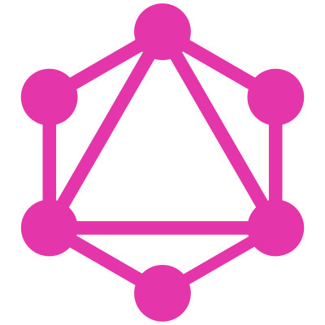

# GraphQL Practice! 

## [(Click Here To Check Out This Repo's Landing Page)](https://asa55.github.io/graphql-practice/)



## [Find the official tutorial materials here to learn the theory](https://www.howtographql.com/). Notes to myself are below - this tool is used in GatsbyJS (and many more tools I frequently use) so I'm taking this opportunity for a proper refresher.

## [The GraphQL Server I'm running is inspired by this GraphQL+Node Tutorial](https://www.howtographql.com/graphql-js/0-introduction/)

*** Note on using the code in this repo ***
If you want to use this code, you'll need both docker and VSCode with the Remote Container (or Remote Development) extention installed. Pull this code from my github repo into a local folder on your machine, then use VSCode to "open folder inside container". The .devcontainer and Dockerfile will do the rest of the setup for you automatically at that point.

## Info About GraphQL

GraphQL isn't a database (common misconception), but a "query language" (think SQL). More specifically, GraphQL is a specification open-sourced by FB. There are open-source implementations of GraphQL available for every popular programming language, and the great thing is that since they follow the same spec, you can rest easy knowing your GraphQL knowledge is portable across implementations.

When a client wants data from a database, a server mediates the exchange. From the client's perspective, the server contains the "API" code that defines the format of both the request and response.

REST (representational state transfer) as a methodology has until recently been the only name in the game for API development. It's a strict spec, but has been widely interpreted (so REST-like implementations widely vary).

In REST, if you want to return a data structure, you need to develop a new "endpoint" for that functionality. GraphQL on the other hand gives you a single endpoint through which you can make a very specific request, and get only the data you asked for.

So REST generally offers less specific queries compared to GraphQL, making it less efficient for data loading. REST implementations vary, and to make new requests possible the changes can be pretty invasive in the client-side and server-side codebases. GraphQL streamlines this, which improves compatibility with newer dev tooling and generally improves development speed.

REST brought great ideas to the table: 1. stateless servers, 2. structured access to resources.

GraphQL is a "better REST API", in that it does this, but better. Using GraphQL, you can ask for exactly the data you want - no over- or under-fetching. Monitoring the efficiency of these processes is very straightforward and easy to modify. GraphQL offers a strong type system, and a notion of "schema" which is how frontend and backend developers can spell out their expectations for the other team. Once the schema is defined, these teams can work independently of one another.

Schemas, queries and mutations more or less look like JSON objects. If you're familiar with CRUD operations, the R (read) is the standard query, while the C (create) U (update) D (delete) operations are all considered "mutations", and require the mutation keyword (from the client) in order to modify database contents. Conveniently, you can mutate and request data in a single round-trip. Say you add a table entry and want to know the unique ID that was created for this entry - you can write and read in the same request, which boosts network efficiency (by encouraging fewer requests).

GraphQL supports "Subscriptions" (a keyword) where clients open a persistent connection to the server and as long as the connection remains open the server can push data to all subscribers.

For schema development, keywords we'll use constantly are "type" (String, Int, Foat, Boolean, ID, and any user-defined type), as well as the special root types Query, Mutation, and Subscription. These are the entry points for client requests.

Poorly organized notes to myself: the ! operator means "required". Mutations follow request-response-cycle pattern, while Subscriptions represent data streams. Query, Mutation, and Stream are special "root types". The top-level fields of root types are called root fields.

There are three major use-cases for a GraphQL server: first, for database interactions. Second, as a thin layer in front of third party services (as is the case with GatsbyJS). Third would be a combination of the above.

GraphQL is declarative (as opposed to REST, which is imperative). This means that client just tells a GraphQL server what data it wants, and GraphQL takes care of the implementation details - of course, to interact with backend services GraphQL needs to know how to talk to *them*. It does so through the use of "resolver functions". The client is technically responsible, at least in part, for specifying networking and data storage tasks, but this really should be abstracted away from frontend developers - and is precisely what GraphQL client libraries like Relay or Apollo can do for us.

Fragments, parameterized queries, aliases, enums, interfaces, and unions are advanced concepts. GraphQL offers introspection - whoever programmed the schema knows what the API can do, but frontend programmers (who may not know the schema) can request info about it using the "__" (double-underscore) operator. The GraphiQL tool uses introspection heavily. In case of error, an "error" field is returned.

greenfield projects

timeouts, max query depth, throttling by server time (leaky bucket algorithm)

"
How to do Authentication and Authorization?
Authentication and authorization are often confused. Authentication describes the process of claiming an identity. That’s what you do when you log in to a service with a username and password, you authenticate yourself. Authorization on the other hand describes permission rules that specify the access rights of individual users and user groups to certain parts of the system.

Authentication in GraphQL can be implemented with common patterns such as OAuth.

To implement authorization, it is recommended to delegate any data access logic to the business logic layer and not handle it directly in the GraphQL implementation. If you want to have some inspiration on how to implement authorization, you can take a look at Graphcool’s permission rules.
"

[Can't forget - the official docs are here](https://graphql.org/learn/)

Check out GraphiQL and a derivative work, [GraphQL Playground](https://github.com/graphql/graphql-playground)

Projects, Services, and Databases [listed here](https://landscape.graphql.org/) are helpful!

I'm interested in the [graphql-node tutorial and the React+Apollo tutorial](https://www.howtographql.com/choose/)

## Now that we're through with the theory, here's how you can locally run the code in this repo:

1. You'll need to have Docker installed (sorry this step isn't trivial - but it's worth the effort I promise)
2. Download VSCode if you don't have it already, and get the Remote Development extension (Remote Containers, specifically)
3. Clone this repo locally, and use VSCode to "open the folder in a container" (at which point the .devcontainer contents and Dockerfile contents will assemble the containerized environment for you)
4. From *inside the container*, run the terminal command ```node index.js``` (this will start the GraphQL server and expose it on port 4000 - the container port 4000 has been mapped to your localhost:4000 for convenience)
5. Open whatever internet browser you prefer and navigate to localhost:4000

That's it! At that point you'll see a GUI (GraphQL Playground) where you can experiment with GraphQL commands. Enjoy!